```mermaid
flowchart TD
    %% ──────────────────────────────────────────────
    %% START NODE
    %% ──────────────────────────────────────────────
    START([START: Workflow Triggered])
    START --> VALIDATE_INPUT

    %% ──────────────────────────────────────────────
    %% INPUT VALIDATION
    %% ──────────────────────────────────────────────
    VALIDATE_INPUT{{"Input Validation Gate"}}
    VALIDATE_INPUT -- "Valid inputs" --> CONTENT_GEN
    VALIDATE_INPUT -- "Invalid inputs" --> FAIL_INPUT([TERMINAL: Failed — Invalid Input])

    %% ──────────────────────────────────────────────
    %% CONTENT GENERATION (Step 1)
    %% ──────────────────────────────────────────────
    CONTENT_GEN["CONTENT GENERATION
    ─────────────────
    • Read & confirm inputs
    • Plan page structure
    • Write hook, posts, deep dives
    • Build quick reference
    • Construct JSON output
    ─────────────────
    Output: article_md + article_json"]

    CONTENT_GEN --> EVAL_GATE

    %% ──────────────────────────────────────────────
    %% EVALUATION GATE (2 Eval Passes)
    %% ──────────────────────────────────────────────
    EVAL_GATE["EVALUATION GATE"]
    EVAL_GATE --> EVAL_PASS_1 & EVAL_PASS_2

    EVAL_PASS_1["EVAL PASS 1: Content Safety & Guard Rails
    ────────────────────────────
    Structural guard checks:
    • No deep dives in main intro section
    • Sections/posts missing deep dives are disallowed
    • No prose-only blobs: convert to bullet items or structured sub-sections
      per content tree when required
    ────────────────────────────
    • Hard safety flags
    • Topic exclusions
    • Deny-list topics (configurable)
    • Additional guard rails (configurable JSON policy)
    • Real person policy
    • Controversy check
    • Negativity & bias scan
    • Humour evaluation
    • Source exclusions
    • Copyright compliance
    • Image safety
    • JSON safety flags
    ────────────────────────────
    Output: moderation_report
    Result: PASS / VIOLATION"]

    EVAL_PASS_2["EVAL PASS 2: Quality & Structure (Non-Negotiable)
    ────────────────────────────
    Composition checks:
    • No deep dives in main intro section
    • Sections/posts missing deep dives are disallowed
    • No prose-only blobs: convert to bullet items or structured sub-sections
      per content tree when required
    • Nomenclature integrity: Article = Page (composition), Section = Post
    • Composability intent: sections must be independently renderable as posts
      while still composing into a full page/article
    ────────────────────────────
    Creativity & Narration:
    • Hook quality
    • Title quality
    • Three-beat structure
    • Sentence rhythm & voice
    • Content option visual rhythm
    • Deep dive quality
    • India warmth & specificity
    • Quick reference quality
    ────────────────────────────
    Schema Validation:
    • Root envelope
    • Word count meta
    • Hero, hook, sections
    • Body schemas per option
    • Deep dives, quick ref
    • Narrative metadata
    • Sources, images
    ────────────────────────────
    Output: eval_report + schema_report
    Result: PASS / REVISION NEEDED"]

    EVAL_PASS_1 --> EVAL_MERGE
    EVAL_PASS_2 --> EVAL_MERGE

    %% ──────────────────────────────────────────────
    %% EVALUATION MERGE & DECISION
    %% ──────────────────────────────────────────────
    EVAL_MERGE{{"Merge Eval Results"}}
    EVAL_MERGE -- "Both PASS" --> SCHEMA_FINAL
    EVAL_MERGE -- "Any FAIL & attempts < max_refine" --> REFINE
    EVAL_MERGE -- "Any FAIL & attempts >= max_refine" --> FAIL_EVAL([TERMINAL: Failed — Eval Criteria Not Met])

    %% ──────────────────────────────────────────────
    %% SCHEMA FINAL CHECK
    %% ──────────────────────────────────────────────
    SCHEMA_FINAL{{"Final Output Validation"}}
    SCHEMA_FINAL -- "Valid" --> SUCCESS
    SCHEMA_FINAL -- "Invalid" --> FAIL_SCHEMA([TERMINAL: Failed — Schema Validation])

    %% ──────────────────────────────────────────────
    %% REFINE PASS (max 1 iteration)
    %% ──────────────────────────────────────────────
    REFINE["REFINE PASS
    ─────────────────
    • Receive violation/revision reports
    • Identify specific failures
    • Apply targeted corrections
    • Preserve passing elements
    • Regenerate affected sections
    ─────────────────
    Output: refined_article_md + refined_article_json"]

    REFINE --> CONTENT_GEN_REFINED

    CONTENT_GEN_REFINED["UPDATED CONTENT GENERATION
    ─────────────────
    • Incorporate refinement directives
    • Regenerate with violations flagged
    • Full article reconstruction
    ─────────────────
    Output: article_md + article_json"]

    CONTENT_GEN_REFINED --> EVAL_GATE

    %% ──────────────────────────────────────────────
    %% SUCCESS TERMINAL
    %% ──────────────────────────────────────────────
    SUCCESS([TERMINAL: Success — Content Generated])

    %% ──────────────────────────────────────────────
    %% FAILURE TERMINALS
    %% ──────────────────────────────────────────────

    %% ──────────────────────────────────────────────
    %% STYLING
    %% ──────────────────────────────────────────────
    style START fill:#2d6a4f,stroke:#1b4332,color:#fff
    style SUCCESS fill:#2d6a4f,stroke:#1b4332,color:#fff
    style FAIL_INPUT fill:#9d0208,stroke:#6a040f,color:#fff
    style FAIL_EVAL fill:#9d0208,stroke:#6a040f,color:#fff
    style FAIL_SCHEMA fill:#9d0208,stroke:#6a040f,color:#fff
    style CONTENT_GEN fill:#264653,stroke:#1d3557,color:#fff
    style CONTENT_GEN_REFINED fill:#264653,stroke:#1d3557,color:#fff
    style EVAL_PASS_1 fill:#e76f51,stroke:#c1440e,color:#fff
    style EVAL_PASS_2 fill:#e76f51,stroke:#c1440e,color:#fff
    style REFINE fill:#f4a261,stroke:#e76f51,color:#000
    style VALIDATE_INPUT fill:#457b9d,stroke:#1d3557,color:#fff
    style EVAL_GATE fill:#457b9d,stroke:#1d3557,color:#fff
    style EVAL_MERGE fill:#457b9d,stroke:#1d3557,color:#fff
    style SCHEMA_FINAL fill:#457b9d,stroke:#1d3557,color:#fff
```

# Content Generation Agentic Workflow — Flow Diagram
## Version 1.0 · March 2026

---

---

## Notes

1. **Parallel vs Sequential Eval Passes**: Eval Pass 1 (Content Moderation) and Eval Pass 2 (Quality & Structure) are shown as parallel branches. However, **eval passes may need to run sequentially** if mandated by token/context limits of the underlying LLM provider. In sequential mode, Eval Pass 1 (safety) MUST run first — if it fails, Eval Pass 2 is skipped entirely.

2. **Refine Loop**: The refine pass feeds back into a full content generation cycle followed by the same 2 eval passes. The loop is bounded by `max_refine_attempts` (default: 1). This prevents infinite loops while allowing one corrective iteration.

3. **Terminal States**: The workflow has exactly 4 terminal states:
   - **Success** — content generated, all evals passed
   - **Failed: Invalid Input** — input validation gate rejected the request
   - **Failed: Eval Criteria Not Met** — evals failed after max refine attempts exhausted
   - **Failed: Schema Validation** — final output validation failed (structural)

4. **Runtime Errors**: Any unhandled runtime error at any stage results in a terminal failure with error details captured in workflow execution metadata.
