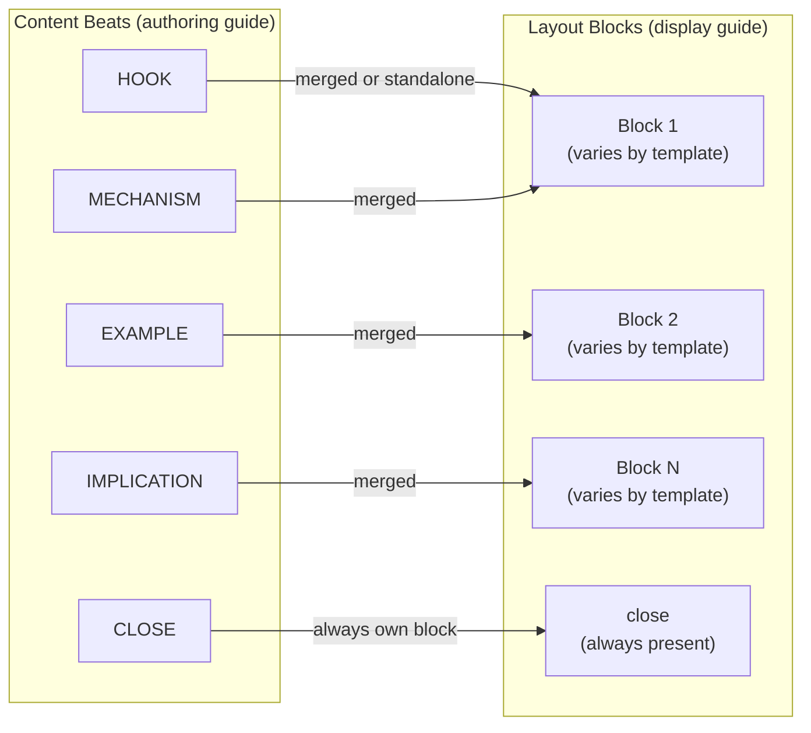
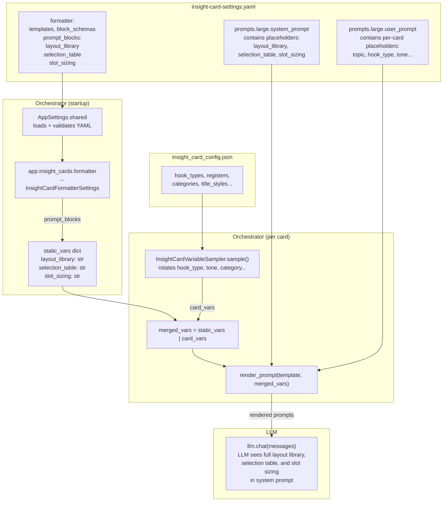

# Insight Card — UI Skeleton Layout Spec
## Version 1.1 — April 2026

---

## 1. Purpose

The insight card LLM currently returns a single flat `content` string per card. The mobile/web
UI needs structural hints to render this content as rich formatted text — paragraphs with visual
spacing, bullet lists, highlighted leads, standalone callout sentences, etc.

This spec defines:
- A **layout template library** — 5 named templates that describe the visual block arrangement
- A **content_blocks schema** — the LLM returns a dict whose keys match the chosen layout's blocks
- A **selection table** — maps the card's existing seed variables (hook_type, emotional_register, title_style) to a recommended layout
- A **slot sizing contract** — word/sentence limits per block type to keep cards compact
- A **runtime block injection architecture** — how the layout library reaches the LLM prompt without being hardcoded in the YAML template

The existing flat `content` field is preserved for backward compatibility. The LLM writes **both**
`content` (joined prose) and `layout` + `content_blocks` (structured UI skeleton).

### 1.1 Key Design Decision: LLM Selects the Layout (Option A)

The LLM receives the full layout library, selection table, and slot sizing rules in its prompt
and chooses the best layout for each card. The orchestrator does NOT pre-select the layout.

Rationale:
- The LLM is the only actor that sees both the seed variables AND the actual content being written.
  It can make a better layout choice based on what the content "wants to be."
- The selection table is a **recommendation** — the LLM may override if the content clearly
  benefits from a different layout.
- Keeping selection in the LLM avoids orchestrator complexity and keeps the prompt as the single
  source of truth for generation behavior.

### 1.2 Key Design Decision: Runtime Block Injection (Not Hardcoded in YAML)

The layout library, selection table, and slot sizing rules are stored as structured data in
`insight_card_config.json` and injected into the YAML prompt template at runtime via
`{layout_library}`, `{selection_table}`, and `{slot_sizing}` variables.

These are **static, one-time injections** — loaded once at orchestrator startup and reused across
all card invocations. They are NOT rotated per card like `{hook_type}`, `{tone}`, etc.

Rationale:
- Layout definitions are data, not prose. They belong in a structured config file where they can
  be versioned, diffed, and programmatically validated.
- The YAML prompt template stays clean — it references the layout data via placeholders, just like
  it references seed variables.
- Changing layouts (adding a new template, tweaking sizing) requires editing the config JSON only,
  not the prompt YAML.

---

## 2. Terminology

| Term | Definition |
|------|-----------|
| **Content beats** | The 5 conceptual writing segments: HOOK, MECHANISM, EXAMPLE, IMPLICATION, CLOSE. These are authoring instructions — they tell the LLM *what* to write. |
| **Layout template** | A named arrangement of visual blocks. Tells the UI *how* to display the content. |
| **Content block** | A keyed piece of the card content that maps directly to a UI component (paragraph, bullet list, callout, etc.). |
| **Seed variables** | The per-card generation parameters sampled by the orchestrator: `hook_type`, `emotional_register`, `title_style`, `opening_word_class`, `category`, `theme`, `human_context`. |

---

## 3. Relationship: Content Beats vs Layout Blocks

The 5 content beats are the **writing guide**. The layout blocks are the **display guide**.
Different layouts group the same beats into different visual containers.



Key principle: **the beats always exist conceptually, but they are not always separate visual blocks.**
A `two_para_close` layout folds HOOK into para1 alongside MECHANISM — the hook is there in the prose
but not visually isolated. A `hook_body_close` layout gives HOOK its own standalone block.

### 3.1 Beat-to-Block Mapping per Layout

```mermaid
graph TD
    subgraph hbc ["hook_body_close"]
        HBC_HOOK["hook ← HOOK"]
        HBC_BODY["body ← MECH + EX + IMP"]
        HBC_CLOSE["close ← CLOSE"]
        HBC_HOOK --> HBC_BODY --> HBC_CLOSE
    end

    subgraph tpc ["two_para_close"]
        TPC_P1["para1 ← HOOK + MECH"]
        TPC_P2["para2 ← EX + IMP"]
        TPC_CLOSE["close ← CLOSE"]
        TPC_P1 --> TPC_P2 --> TPC_CLOSE
    end

    subgraph thpc ["three_para_close"]
        THPC_P1["para1 ← HOOK + setup"]
        THPC_P2["para2 ← MECH"]
        THPC_P3["para3 ← EX + IMP"]
        THPC_CLOSE["close ← CLOSE"]
        THPC_P1 --> THPC_P2 --> THPC_P3 --> THPC_CLOSE
    end

    subgraph lbc ["lead_body_close"]
        LBC_LEAD["lead ← HOOK highlighted"]
        LBC_BODY["body ← MECH + EX + IMP"]
        LBC_CLOSE["close ← CLOSE"]
        LBC_LEAD --> LBC_BODY --> LBC_CLOSE
    end

    subgraph pbc ["para_bullets_close"]
        PBC_PARA["para ← HOOK + MECH"]
        PBC_BULLETS["bullets ← EX items"]
        PBC_CLOSE["close ← CLOSE"]
        PBC_PARA --> PBC_BULLETS --> PBC_CLOSE
    end
```



---

## 4. Layout Template Library

All 5 templates end with a mandatory `close` block.

### 4.1 `hook_body_close`

The hook gets standalone visual treatment — rendered as a callout, subtitle, or
visually distinct opening line. Best when the hook is stylistically different from the title
(e.g. title is a concept name, hook is a question).

**Block schema:**
```
{
  "hook":  str,   // 1 sentence. Standalone attention-grabber.
  "body":  str,   // 3–5 sentences. MECHANISM + EXAMPLE + IMPLICATION merged.
  "close": str    // 1 sentence. Reflective or reframing.
}
```

**Beat mapping:**
```
HOOK       → hook  (standalone)
MECHANISM  ─┐
EXAMPLE    ─┼→ body
IMPLICATION─┘
CLOSE      → close
```

**UI rendering hint:** `hook` as italic callout or larger font opening line; `body` as
standard paragraph; `close` as italic or muted-tone sentence.

**Best fit seed variables:**
- hook_type: `question-led`, `contrarian-claim`
- emotional_register: `wonder`, `challenge`
- title_style: any (works especially well when title is a named concept and hook is a question)

---

### 4.2 `two_para_close`

Two balanced paragraphs. The hook is folded into the first paragraph — no standalone
visual element. Reads like a natural two-beat rhythm: setup then payoff.

**Block schema:**
```
{
  "para1": str,   // 2–3 sentences. HOOK folded in + MECHANISM.
  "para2": str,   // 2–3 sentences. EXAMPLE + IMPLICATION.
  "close": str    // 1 sentence.
}
```

**Beat mapping:**
```
HOOK      ─┐
MECHANISM ─┘→ para1
EXAMPLE    ─┐
IMPLICATION─┘→ para2
CLOSE      → close
```

**UI rendering hint:** Two text blocks of roughly equal visual weight with a line break or
spacing between them. `close` as a trailing line (italic or muted).

**Best fit seed variables:**
- hook_type: `story-opening`, `analogy-led`
- emotional_register: `comfort`, `nostalgia`
- title_style: `short declarative statement`, `the X that Y construction`

---

### 4.3 `three_para_close`

Three compact paragraphs. Gives each content beat more breathing room. Good for layered
topics where the mechanism, example, and implication are each distinct enough to stand alone.

**Block schema:**
```
{
  "para1": str,   // 2 sentences. HOOK + setup/framing.
  "para2": str,   // 2 sentences. MECHANISM / depth.
  "para3": str,   // 2 sentences. EXAMPLE + IMPLICATION.
  "close": str    // 1 sentence.
}
```

**Beat mapping:**
```
HOOK      → para1 (folded in with setup)
MECHANISM → para2
EXAMPLE    ─┐
IMPLICATION─┘→ para3
CLOSE      → close
```

**UI rendering hint:** Three short text blocks with visual breaks between them. Each paragraph
should feel like a distinct thought, not a continuation. `close` as trailing line.

**Best fit seed variables:**
- hook_type: `named-concept`, `analogy-led`
- emotional_register: `wonder`, `challenge`, `nostalgia`
- title_style: `named concept reveal`, `unexpected juxtaposition`
- categories: Science, History, Psychology (topics with distinct conceptual layers)

---

### 4.4 `lead_body_close`

The opening is a highlighted concept reveal — the card's core idea unpacked in one
or two bold sentences. Followed by a dense explanatory body. Works best when the title
names a concept and the lead explains what it means before the body explores it.

**Block schema:**
```
{
  "lead":  str,   // 1–2 sentences. Concept name unpacked. Rendered bold/highlighted.
  "body":  str,   // 3–4 sentences. MECHANISM + EXAMPLE + IMPLICATION merged.
  "close": str    // 1 sentence.
}
```

**Beat mapping:**
```
HOOK       → lead  (standalone, visually highlighted)
MECHANISM  ─┐
EXAMPLE    ─┼→ body
IMPLICATION─┘
CLOSE      → close
```

**UI rendering hint:** `lead` rendered in bold, slightly larger font, or as a
highlighted/boxed sentence. `body` as standard paragraph. `close` as trailing line.

**Distinction from `hook_body_close`:** The `hook` block is an attention-grabber
(question, claim) meant to provoke curiosity. The `lead` block is a concept reveal
meant to name and briefly define the card's core idea. The `hook` says "did you know?";
the `lead` says "here's a concept called X, and it means Y."

**Best fit seed variables:**
- hook_type: `named-concept`
- emotional_register: any
- title_style: `named concept reveal`, `rule or principle framing`
- categories: any (especially effective for Finance, Culture, History)

---

### 4.5 `para_bullets_close`

An opening paragraph followed by a bullet list and a closing sentence. The bullets
surface discrete observations, examples, or action points that benefit from being
visually scannable rather than buried in prose.

**Block schema:**
```
{
  "para":    str,        // 2–3 sentences. HOOK + MECHANISM.
  "bullets": [str],      // 2–4 items. Each item <= 15 words. EXAMPLE items or observations.
  "close":   str         // 1 sentence.
}
```

**Beat mapping:**
```
HOOK      ─┐
MECHANISM ─┘→ para
EXAMPLE    → bullets  (broken into discrete items)
IMPLICATION→ (folded into close OR into the last bullet contextually)
CLOSE      → close
```

**UI rendering hint:** Standard paragraph, then an unordered list (bullet points or
dash-separated items), then a trailing close line.

**Best fit seed variables:**
- hook_type: any (especially `contrarian-claim`)
- emotional_register: `urgency`, `challenge`
- title_style: any
- categories: Finance, Wellness, Life, Urban Life (practical categories where
  the insight has discrete sub-points)

---

## 5. Selection Table

The orchestrator passes all seed variables to the LLM. The LLM uses this table to
choose the best-fit layout. The table is a **recommendation, not a hard constraint** —
if the content clearly benefits from a different layout, the LLM may override.

### Primary selection (hook_type + emotional_register)

| hook_type | emotional_register | recommended layout |
|-----------|-------------------|-------------------|
| `contrarian-claim` | `wonder`, `challenge` | `hook_body_close` |
| `question-led` | `wonder`, `challenge` | `hook_body_close` |
| `question-led` | `comfort`, `nostalgia` | `two_para_close` |
| `story-opening` | `comfort`, `nostalgia` | `two_para_close` |
| `story-opening` | `wonder` | `three_para_close` |
| `analogy-led` | `comfort`, `nostalgia` | `two_para_close` |
| `analogy-led` | `wonder`, `challenge` | `three_para_close` |
| `named-concept` | any | `lead_body_close` |
| any | `urgency` | `para_bullets_close` |
| `contrarian-claim` | `comfort` | `para_bullets_close` |

### Title-style override (takes precedence when matched)

| title_style | overrides to |
|-------------|-------------|
| `named concept reveal` | `lead_body_close` |
| `rule or principle framing` | `lead_body_close` |
| `intriguing question` | `hook_body_close` |

### Category affinity (tiebreaker, not override)

| category | favors |
|----------|--------|
| Science, History, Psychology | `three_para_close` (layered topics) |
| Finance, Wellness, Urban Life | `para_bullets_close` (actionable topics) |
| Life, Culture, Mindfulness | `two_para_close` (reflective topics) |
| Travel | `two_para_close` or `three_para_close` |
| Technology | `hook_body_close` or `lead_body_close` |

---

## 6. Slot Sizing Contract

Hard limits per block type. These keep cards within the 120–180 word target
(content only, excluding title) and prevent any single block from dominating.

| Block type | Sentences | Word limit | Notes |
|-----------|-----------|-----------|-------|
| `hook` | 1 | 15–30 words | Must be a single sentence. Question, claim, or reveal. |
| `lead` | 1–2 | 20–40 words | Concept name + brief unpacking. |
| `body` | 3–5 | 50–90 words | Dense but readable. No jargon. |
| `para` / `para1` / `para2` / `para3` | 2–3 | 30–60 words | Each paragraph is a self-contained thought. |
| `bullets` | 2–4 items | Each item <= 15 words | Short, scannable. No nested lists. No markdown within items. |
| `close` | 1 | 10–25 words | Reframe, lingering thought, or quiet prompt. |

### Total word budget per layout

| Layout | Typical range | Max (hard cap) |
|--------|--------------|---------------|
| `hook_body_close` | 75–145 words | 160 |
| `two_para_close` | 70–145 words | 160 |
| `three_para_close` | 80–160 words | 180 |
| `lead_body_close` | 80–155 words | 170 |
| `para_bullets_close` | 70–140 words | 160 |

---

## 7. Block Vocabulary Reference

All block names used across layouts and their consistent definitions.

```mermaid
graph TD
    subgraph openers ["Opener Blocks (mutually exclusive, max 1 per layout)"]
        hookBlock["hook — standalone attention-grabber\n1 sentence, question/claim/reveal"]
        leadBlock["lead — concept reveal, highlighted\n1-2 sentences, bold/boxed"]
    end

    subgraph content_blocks ["Content Blocks (1+ per layout)"]
        bodyBlock["body — dense explanatory paragraph\nMECH + EX + IMP merged, 3-5 sentences"]
        paraBlock["para — opening paragraph before bullets\nhook folded in + mechanism, 2-3 sentences"]
        para1Block["para1 — first paragraph\nhook folded in + setup, 2-3 sentences"]
        para2Block["para2 — second paragraph\nexample + implication or depth, 2-3 sentences"]
        para3Block["para3 — third paragraph\nexample + implication, 2 sentences"]
        bulletsBlock["bullets — scannable list\n2-4 items, each <=15 words"]
    end

    subgraph closer ["Closer Block (mandatory in ALL layouts)"]
        closeBlock["close — final reflective sentence\nreframe or lingering thought, 1 sentence"]
    end

    hookBlock -.->|"used in"| L1["hook_body_close"]
    leadBlock -.->|"used in"| L4["lead_body_close"]
    bodyBlock -.->|"used in"| L1
    bodyBlock -.->|"used in"| L4
    paraBlock -.->|"used in"| L5["para_bullets_close"]
    para1Block -.->|"used in"| L2["two_para_close"]
    para1Block -.->|"used in"| L3["three_para_close"]
    para2Block -.->|"used in"| L2
    para2Block -.->|"used in"| L3
    para3Block -.->|"used in"| L3
    bulletsBlock -.->|"used in"| L5
    closeBlock -.->|"used in all"| L1
    closeBlock -.->|"used in all"| L2
    closeBlock -.->|"used in all"| L3
    closeBlock -.->|"used in all"| L4
    closeBlock -.->|"used in all"| L5
```



| Block name | Definition | Appears in layouts |
|-----------|-----------|-------------------|
| `hook` | Standalone attention-grabbing sentence. Rendered as callout, subtitle, or visually distinct line. Stylistically different from `title` — if title is a concept name, hook is a question or claim. | `hook_body_close` |
| `lead` | Concept reveal. Names and briefly unpacks the card's core idea. Rendered bold or highlighted. | `lead_body_close` |
| `body` | Dense explanatory paragraph. Mechanism + example + implication merged into flowing prose. | `hook_body_close`, `lead_body_close` |
| `para` | Opening paragraph before a bullet list. Hook folded in + mechanism. | `para_bullets_close` |
| `para1` | First paragraph in a multi-paragraph layout. Hook folded in + mechanism or setup. | `two_para_close`, `three_para_close` |
| `para2` | Second paragraph. Example + implication (in two_para_close) or mechanism/depth (in three_para_close). | `two_para_close`, `three_para_close` |
| `para3` | Third paragraph. Example + implication. | `three_para_close` |
| `bullets` | List of 2–4 short items. Each item is a discrete observation, example, or action point. | `para_bullets_close` |
| `close` | Final reflective sentence. Reframe, lingering thought, or quiet action prompt. | ALL layouts (mandatory) |

---

## 8. Hook vs Title — Design Intent

The `title` and `hook` (or `lead`) serve different purposes:

| | Title | Hook (block) | Lead (block) |
|-|-------|-------------|-------------|
| **Purpose** | Card-level heading. Grabs attention in a feed/list view. | Content-level opener. Provokes curiosity once the card is opened. | Content-level opener. Names and unpacks the core concept. |
| **Position** | Above the content area, rendered as heading. | First element inside the content area. | First element inside the content area. |
| **Style** | Punchy, max 8 words. Can be a concept name, question, or framing. | 1 sentence. Question, counterintuitive claim, or vivid image. | 1–2 sentences. Bold/highlighted concept explanation. |
| **When standalone** | Always standalone (it's the title). | Only in `hook_body_close`. In other layouts, the hook is folded into the first paragraph. | Only in `lead_body_close`. |

Visual stacking example for `hook_body_close`:
```
┌─────────────────────────────────┐
│  The Micro-Habit Multiplier     │  ← title (heading)
│                                 │
│  Why do small, everyday         │  ← hook (callout/subtitle style)
│  financial decisions feel so    │
│  much larger over time?         │
│                                 │
│  Our brains thrive on           │  ← body (standard paragraph)
│  efficiency, turning repeated   │
│  actions into automatic habits  │
│  ...                            │
│                                 │
│  A quiet awareness can          │  ← close (italic/muted)
│  transform your financial       │
│  landscape with surprising ease.│
└─────────────────────────────────┘
```

Visual stacking example for `two_para_close` (hook folded in):
```
┌─────────────────────────────────┐
│  The Micro-Habit Multiplier     │  ← title (heading)
│                                 │
│  Why do small, everyday         │  ← para1 (hook + mechanism, standard paragraph)
│  financial decisions feel so    │
│  much larger? Our brains thrive │
│  on efficiency, turning actions │
│  into automatic habits...       │
│                                 │
│  That daily morning coffee or   │  ← para2 (example + implication)
│  the streaming service you      │
│  rarely use slips through       │
│  unnoticed...                   │
│                                 │
│  A quiet awareness can          │  ← close (italic/muted)
│  transform your landscape.      │
└─────────────────────────────────┘
```

---

## 9. Output Schema

### 9.1 JSON structure (what the LLM returns)

```json
{
  "title": "The Micro-Habit Multiplier",
  "category": "Finance",
  "content": "Why do small, everyday financial decisions often feel so much larger over time? Our brains thrive on efficiency, turning repeated actions into automatic habits to conserve energy. That daily morning coffee or the streaming service you rarely use slips through unnoticed, precisely because it's part of your established flow. Gently noticing these automatic patterns isn't about restriction, but about understanding where your energy and resources genuinely go. A quiet awareness of these micro-habits can transform your financial landscape with surprising ease.",
  "layout": "hook_body_close",
  "content_blocks": {
    "hook": "Why do small, everyday financial decisions often feel so much larger over time?",
    "body": "Our brains thrive on efficiency, turning repeated actions into automatic habits to conserve energy. That daily morning coffee or the streaming service you rarely use slips through unnoticed, precisely because it's part of your established flow. Gently noticing these automatic patterns isn't about restriction, but about understanding where your energy and resources genuinely go.",
    "close": "A quiet awareness of these micro-habits can transform your financial landscape with surprising ease."
  },
  "tone": "comfort",
  "emotional_register": "comfort",
  "title_style": "named concept reveal",
  "hook_type": "question-led",
  "opening_word_class": "question-word"
}
```

### 9.2 Consistency rule

The `content` field MUST be the concatenation of all `content_blocks` values joined with a
single space. The LLM writes both, and the orchestrator may optionally validate consistency
by checking that joining `content_blocks` values produces a string that matches `content`
(after whitespace normalization).

### 9.3 Example per layout

**`hook_body_close`** (from sample card: Finance / question-led / comfort):
```json
{
  "layout": "hook_body_close",
  "content_blocks": {
    "hook": "Why do small, everyday financial decisions often feel so much larger over time?",
    "body": "Our brains thrive on efficiency, turning repeated actions into automatic habits to conserve energy. That daily morning coffee or the streaming service you rarely use slips through unnoticed, precisely because it's part of your established flow. Gently noticing these automatic patterns isn't about restriction, but about understanding where your energy and resources genuinely go.",
    "close": "A quiet awareness of these micro-habits can transform your financial landscape with surprising ease."
  }
}
```

**`two_para_close`** (hypothetical: Life / story-opening / comfort):
```json
{
  "layout": "two_para_close",
  "content_blocks": {
    "para1": "There's a moment every evening when the house goes quiet and your mind suddenly replays the one thing you said wrong. This isn't random — your brain treats unfinished emotional business like an open browser tab, consuming attention until it's resolved.",
    "para2": "You might notice this most after a conversation where you held back. The unsaid thing lingers precisely because your mind is still rehearsing it, searching for closure that never came.",
    "close": "Sometimes the quietest thought in the room is the one asking most loudly to be heard."
  }
}
```

**`three_para_close`** (hypothetical: Science / analogy-led / wonder):
```json
{
  "layout": "three_para_close",
  "content_blocks": {
    "para1": "Your kitchen sponge hosts more bacteria per square centimetre than your toilet seat. The warm, moist, food-rich environment is a microbiome paradise.",
    "para2": "Microwaving or boiling the sponge kills the weaker bacteria but leaves behind the hardiest survivors, which then repopulate the empty space with less competition.",
    "para3": "The same pattern shows up in antibiotic resistance and even in workplace culture after layoffs — removing the average performers concentrates the extremes.",
    "close": "Sometimes the best clean-up strategy is knowing when to simply replace rather than sterilize."
  }
}
```

**`lead_body_close`** (from sample card: Technology / named-concept / challenge):
```json
{
  "layout": "lead_body_close",
  "content_blocks": {
    "lead": "The Presence Performance Paradox is the tendency to equate visible digital activity — emails sent, tabs open, meetings attended — with genuine productivity.",
    "body": "This bias leads us to judge contributions more by apparent busyness than by actual quality. Someone rapidly switching between applications might be perceived as more engaged than a colleague quietly solving a complex problem for hours. Challenge yourself to look beyond the superficial indicators of effort.",
    "close": "Reframe your measure of worth from being seen to truly seeing the work through."
  }
}
```

**`para_bullets_close`** (hypothetical: Wellness / contrarian-claim / urgency):
```json
{
  "layout": "para_bullets_close",
  "content_blocks": {
    "para": "Drinking eight glasses of water a day is one of those health mantras that sounds precise but has no single scientific origin. Your body already has a finely tuned hydration signal — it's called thirst.",
    "bullets": [
      "Tea, coffee, and food all count toward daily hydration",
      "Overhydration can dilute blood sodium to dangerous levels",
      "Urine colour is a more reliable guide than a fixed number"
    ],
    "close": "Listen to the signal your body has been sending all along."
  }
}
```

---

## 10. Pydantic Model Changes

### 10.1 InsightCard (LLM output model)

Current model in `python/tennl/batch/src/tennl/batch/domain/insight_cards.py`:

```python
class InsightCard(BaseModel):
    model_config = ConfigDict(extra="forbid")
    title: str
    category: str
    content: str
    tone: str
    emotional_register: str
    title_style: str
    hook_type: str
    opening_word_class: str
```

Updated model:

```python
class InsightCard(BaseModel):
    model_config = ConfigDict(extra="forbid")
    title: str
    category: str
    content: str
    layout: str
    content_blocks: dict[str, str | list[str]]
    tone: str
    emotional_register: str
    title_style: str
    hook_type: str
    opening_word_class: str
```

`layout` is `str`, not `Literal`. Invalid layout names are caught by **soft orchestrator
validation** (see 10.3), not by Pydantic's model parse. This prevents losing an otherwise
valid card if the LLM returns a slightly wrong layout name (e.g. `"hook-body-close"`
instead of `"hook_body_close"`).

### 10.2 InsightCardResult (persisted card result)

Add explicit `layout` and `content_blocks` fields instead of relying on `extra="allow"`:

```python
class InsightCardResult(BaseModel):
    model_config = ConfigDict(extra="allow")

    title: str = Field(default="")
    category: str = Field(default="")
    content: str = Field(default="")
    layout: Optional[str] = Field(default=None)
    content_blocks: Optional[dict[str, str | list[str]]] = Field(default=None)
    tone: str = Field(default="")
    emotional_register: str = Field(default="")
    title_style: str = Field(default="")
    hook_type: str = Field(default="")
    opening_word_class: str = Field(default="")

    provider: str = Field(default="")
    raw: str = Field(default="")
    error: Optional[str] = Field(default=None)
    metadata: Optional[dict[str, Any]] = Field(default=None)
```

`layout` and `content_blocks` are `Optional` with `None` default so that:
- Old cards (without layout) remain valid
- Dry-run results that skip LLM calls still parse correctly

### 10.3 Validation rules (orchestrator-side, post-parse, soft)

After `InsightCard.model_validate_json()`, the orchestrator validates using the
`formatter.templates` and `formatter.block_schemas` from the YAML settings:

1. `layout` is in `formatter.templates` list — warn if not, but accept the card
2. `content_blocks` keys match `formatter.block_schemas[layout]` — warn if mismatched
3. `bullets` value (when present) is a `list[str]` with 2–4 items — warn if not
4. All other block values are non-empty strings — warn if empty

All validations are **warnings, not hard failures**. The card is accepted if the core
fields (`title`, `content`, `category`) are valid. The orchestrator reads the valid
template names and block schemas from `InsightCardFormatterSettings` (see section 10.4),
not from hardcoded Python constants.

### 10.4 Settings models (new)

New models in `python/tennl/batch/src/tennl/batch/settings/insight_cards/models.py`:

```python
class InsightCardPromptBlocks(BaseModel):
    """Pre-written prompt text injected into the system prompt at runtime."""

    model_config = ConfigDict(extra="forbid")

    layout_library: str
    selection_table: str
    slot_sizing: str


class InsightCardFormatterSettings(BaseModel):
    """Layout templates, block schemas, and prompt injection blocks."""

    model_config = ConfigDict(extra="forbid")

    templates: list[str]
    block_schemas: dict[str, list[str]]
    prompt_blocks: InsightCardPromptBlocks
```

Updated `InsightCardSettings`:

```python
class InsightCardSettings(BaseModel):
    model_config = ConfigDict(extra="forbid")

    generation: InsightCardGenerationSettings = Field(default_factory=InsightCardGenerationSettings)
    formatter: InsightCardFormatterSettings     # required — no default
    prompts: dict[str, InsightCardPromptPack] = Field(default_factory=dict)
```

Export all new models from `settings/insight_cards/__init__.py`.

---

## 11. Prompt Integration — Runtime Block Injection Architecture

### 11.1 Data flow overview



### 11.2 Two variable categories

The prompt template uses `{variable}` placeholders. There are now two categories:

**Static variables (loaded once at startup from `formatter.prompt_blocks`, reused across all cards):**

| Variable | Source in YAML | Content |
|----------|---------------|---------|
| `{layout_library}` | `formatter.prompt_blocks.layout_library` | All 5 template definitions with block keys and beat mappings |
| `{selection_table}` | `formatter.prompt_blocks.selection_table` | The hook_type + register + title_style to layout recommendation table |
| `{slot_sizing}` | `formatter.prompt_blocks.slot_sizing` | Word/sentence limits per block type |

**Per-card variables (rotated by the sampler for each card):**

| Variable | Source | Content |
|----------|--------|---------|
| `{topic}` | Sampled from category themes + contexts | e.g. "behaviour and habit in the context of everyday decisions" |
| `{category}` | Round-robin from category names | e.g. "Finance" |
| `{hook_type}` | Round-robin from hook_types | e.g. "question-led" |
| `{tone}` | Round-robin from registers | e.g. "comfort" |
| `{emotional_register}` | Same as tone | e.g. "comfort" |
| `{title_style}` | Round-robin from title_style_hints.styles | e.g. "named concept reveal" |
| `{opening_word_class}` | Round-robin from opening_word_classes | e.g. "question-word" |
| `{avoid_titles}` | From title_style_hints.avoid | Avoid list |

### 11.3 Prompt structure — before and after

**Before (current `large` system prompt):**

```
You are an insight card writer. Insight cards are short, self-contained pieces
that deliver one genuinely surprising idea with clarity and warmth.

STRUCTURE FOR content (follow in order):
1. HOOK — One sentence. Counterintuitive claim, vivid question, or named concept reveal.
2. MECHANISM — 2–3 sentences. Explain why or how. Plain language. No jargon.
3. EXAMPLE — 1–2 sentences. Concrete, relatable observation. No citations. No statistics.
4. IMPLICATION — 1–2 sentences. What this means for the reader, or a reflection prompt.
5. CLOSE — One memorable sentence. A reframe, lingering thought, or quiet action.

HARD RULES:
- ...
- The JSON must contain exactly these fields:
  title, category, content, tone, emotional_register, title_style, hook_type, opening_word_class
```

**After (updated `large` system prompt):**

```
You are an insight card writer. Insight cards are short, self-contained pieces
that deliver one genuinely surprising idea with clarity and warmth.

WRITING BEATS — follow this order when composing the card content:
1. HOOK — One sentence. Counterintuitive claim, vivid question, or named concept reveal.
2. MECHANISM — 2–3 sentences. Explain why or how. Plain language. No jargon.
3. EXAMPLE — 1–2 sentences. Concrete, relatable observation. No citations. No statistics.
4. IMPLICATION — 1–2 sentences. What this means for the reader, or a reflection prompt.
5. CLOSE — One memorable sentence. A reframe, lingering thought, or quiet action.

UI SKELETON — the card content will be rendered as a formatted UI card. You must choose
a visual layout and split your content into named blocks that map to UI components.
The "content" field contains the full flowing prose. The "content_blocks" field contains
the same text split into the blocks defined by your chosen layout. Both must be consistent —
joining all content_blocks values with a space must produce the content field.

{layout_library}

LAYOUT SELECTION — use the card's hook_type, emotional_register, and title_style to
pick the best-fit layout from the table below. You may override the recommendation if
the content you are writing clearly benefits from a different layout.

{selection_table}

BLOCK SIZING — each block has word and sentence limits to keep cards compact.

{slot_sizing}

HARD RULES:
- No news, current events, or references to studies or publications
- No statistics, percentages, or quantified claims requiring a source
- No harmful, hateful, abusive, sexual, or unsafe content
- No preachy or moralistic tone
- Return valid JSON only. No markdown, prose framing, code fences, or extra keys.
- The JSON must contain exactly these fields:
  title: max 8 words
  category: exactly the provided category
  content: the full flowing card prose (all beats joined)
  layout: the chosen layout template name from the library above
  content_blocks: object with keys matching the chosen layout's block names
  tone: exactly the provided tone
  emotional_register: exactly the provided emotional_register
  title_style: exactly the provided title_style
  hook_type: exactly the provided hook_type
  opening_word_class: exactly the provided opening_word_class
```

**What changed in the prompt and why:**

1. **"STRUCTURE FOR content" renamed to "WRITING BEATS"** — Clarifies these are compositional
   instructions (what to write), not output field names. Prevents confusion with layout blocks.

2. **"UI SKELETON" bridging paragraph added** — Tells the LLM that content will be rendered as
   a formatted UI card, it must choose a layout, split content into named blocks, and both
   `content` and `content_blocks` must be consistent.

3. **`{layout_library}` injected after the UI SKELETON context** — The LLM understands why the
   library exists before reading its contents.

4. **"LAYOUT SELECTION" section wraps `{selection_table}`** — Tells the LLM to use the card's
   variables to pick a layout, with explicit permission to override.

5. **"BLOCK SIZING" 1-liner wraps `{slot_sizing}`** — Contextualizes the sizing limits before
   the LLM reads them.

6. **Updated JSON field list** — Added `layout` and `content_blocks` with descriptions.

7. **User prompt unchanged** — Per-card variables are the same. Layout choice is made by the
   LLM based on these variables + the selection table in the system prompt.

### 11.4 How the YAML prompt template references layout data

The `large` system prompt in `insight-card-settings.yaml` uses the static placeholders:

```yaml
large:
  system_prompt: |
    You are an insight card writer. ...

    WRITING BEATS — follow this order when composing the card content:
    1. HOOK — ...
    2. MECHANISM — ...
    ...

    UI SKELETON — the card content will be rendered as a formatted UI card. You must choose
    a visual layout and split your content into named blocks that map to UI components.
    The "content" field contains the full flowing prose. The "content_blocks" field contains
    the same text split into the blocks defined by your chosen layout. Both must be consistent —
    joining all content_blocks values with a space must produce the content field.

    {layout_library}

    LAYOUT SELECTION — use the card's hook_type, emotional_register, and title_style to
    pick the best-fit layout from the table below. You may override the recommendation if
    the content you are writing clearly benefits from a different layout.

    {selection_table}

    BLOCK SIZING — each block has word and sentence limits to keep cards compact.

    {slot_sizing}

    HARD RULES:
    ...
    - The JSON must contain exactly these fields:
      title, category, content, layout, content_blocks, tone, emotional_register,
      title_style, hook_type, opening_word_class

  user_prompt: |
    Write one insight card.
    Topic: {topic}
    Category: {category}
    ...
```

The static placeholders `{layout_library}`, `{selection_table}`, `{slot_sizing}` are filled
at startup from `formatter.prompt_blocks` in the YAML settings. The per-card placeholders
`{topic}`, `{category}`, etc. are filled per card by the sampler. Both go through the same
`render_prompt()` function.

### 11.5 Orchestrator changes

The orchestrator reads formatter settings at startup:

```python
formatter = app.insight_cards.formatter
static_vars = {
    "layout_library": formatter.prompt_blocks.layout_library,
    "selection_table": formatter.prompt_blocks.selection_table,
    "slot_sizing": formatter.prompt_blocks.slot_sizing,
}
```

In `run_sequential` / `run_parallel`, the static vars are merged with per-card vars
before `render_prompt()`:

```python
card_vars = sampler.sample()
merged_vars = {**static_vars, **card_vars}
# render_prompt(template, merged_vars) fills all placeholders in one pass
```

The `static_vars` dict is passed through `run_sequential` / `run_parallel` /
`generate_one_card` as a parameter.

### 11.6 Prompt budget impact

Adding the layout library + selection table + slot sizing to the system prompt adds
approximately 300–400 tokens to the prompt. At Gemini 2.5 Flash pricing ($0.075/1M
input tokens), this adds ~$0.00003 per card — negligible.

The completion side adds ~80–120 tokens for the `layout` + `content_blocks` fields
(the content is written twice: once flat, once structured). At $0.30/1M output tokens,
this adds ~$0.00003 per card.

### 11.7 New `max_tokens` setting

Current: `max_tokens: 600`. With the added `layout` + `content_blocks` output,
set to `max_tokens: 1000` to give the model sufficient room.

---

## 12. YAML Formatter Configuration

### 12.1 New `formatter` key in `insight-card-settings.yaml`

All layout-related configuration lives in `insight-card-settings.yaml` under a new
top-level `formatter:` key. The JSON config (`insight_card_config.json`) is unchanged —
it continues to hold only seed variable pools.

```yaml
formatter:
  templates:
    - hook_body_close
    - two_para_close
    - three_para_close
    - lead_body_close
    - para_bullets_close

  block_schemas:
    hook_body_close: [hook, body, close]
    two_para_close: [para1, para2, close]
    three_para_close: [para1, para2, para3, close]
    lead_body_close: [lead, body, close]
    para_bullets_close: [para, bullets, close]

  prompt_blocks:
    layout_library: |
      Choose exactly one layout for the "layout" field and populate "content_blocks"
      with the matching keys:

      hook_body_close
        hook: 1 sentence — standalone attention-grabber (question, claim, or reveal)
        body: 3-5 sentences — mechanism + example + implication merged
        close: 1 sentence — reflective reframe or lingering thought

      two_para_close
        para1: 2-3 sentences — hook folded in + mechanism
        para2: 2-3 sentences — example + implication
        close: 1 sentence — reflective reframe or lingering thought

      three_para_close
        para1: 2 sentences — hook + setup
        para2: 2 sentences — mechanism / depth
        para3: 2 sentences — example + implication
        close: 1 sentence — reflective reframe or lingering thought

      lead_body_close
        lead: 1-2 sentences — concept name unpacked (rendered bold/highlighted by UI)
        body: 3-4 sentences — mechanism + example + implication merged
        close: 1 sentence — reflective reframe or lingering thought

      para_bullets_close
        para: 2-3 sentences — hook + mechanism
        bullets: list of 2-4 items, each <=15 words — concrete observations or examples
        close: 1 sentence — reflective reframe or lingering thought

    selection_table: |
      Use hook_type + emotional_register + title_style to pick the best layout:

      hook_type=contrarian-claim + register=wonder/challenge -> hook_body_close
      hook_type=question-led + register=wonder/challenge -> hook_body_close
      hook_type=question-led + register=comfort/nostalgia -> two_para_close
      hook_type=story-opening + register=comfort/nostalgia -> two_para_close
      hook_type=story-opening + register=wonder -> three_para_close
      hook_type=analogy-led + register=comfort/nostalgia -> two_para_close
      hook_type=analogy-led + register=wonder/challenge -> three_para_close
      hook_type=named-concept + any register -> lead_body_close
      any hook_type + register=urgency -> para_bullets_close
      hook_type=contrarian-claim + register=comfort (practical categories) -> para_bullets_close

      Title-style overrides (take precedence):
      title_style=named concept reveal -> lead_body_close
      title_style=rule or principle framing -> lead_body_close
      title_style=intriguing question -> hook_body_close

      You may override the table if the content clearly benefits from a different layout.

    slot_sizing: |
      hook/lead/close: 1-2 sentences, 10-30 words
      body: 3-5 sentences, 50-90 words
      para/para1/para2/para3: 2-3 sentences, 30-60 words
      bullets: 2-4 items, each <=15 words

      Total content word budget: 120-180 words (hard cap).
      The "content" field must equal all content_blocks values joined with a space.
```

### 12.2 Why YAML (not JSON)

- **Multi-line strings are natural**: YAML block scalars (`|`) preserve newlines and indentation.
  The same content in JSON requires `\n` escaping throughout, making it hard to read and edit.
- **Co-located with prompts**: The prompt templates already live in this YAML file. Keeping the
  layout prompt blocks here means everything the LLM sees is in one file.
- **Validated by Pydantic**: The `InsightCardFormatterSettings` model (section 10.4) validates
  the `formatter:` key at startup. Typos in template names or missing fields are caught
  immediately, not at LLM call time.
- **Consistent with existing settings pipeline**: `yaml_settings.py` already loads this YAML
  and feeds it through `AppSettings` validation. No new loading logic needed.

### 12.3 No changes to `insight_card_config.json`

The config JSON retains only the seed variable pools: `hook_types`, `registers`,
`opening_word_classes`, `title_style_hints`, `categories`, and `diversity_matrix`.
No layout-related keys are added.

---

## 13. Scope and Non-Goals

### In scope
- Settings models: `InsightCardPromptBlocks`, `InsightCardFormatterSettings` in `settings/insight_cards/models.py`
- Domain models: `layout` + `content_blocks` on `InsightCard` and `InsightCardResult`
- YAML config: `formatter:` key in `insight-card-settings.yaml` with templates, block_schemas, prompt_blocks
- Prompt changes: all 4 prompt tiers (large, mini, small, moe) with UI SKELETON + placeholder injection
- Orchestrator: static var extraction from formatter, merge with card vars, soft post-parse validation
- `max_tokens` bump to 1000
- Live test with Gemini 2.5 Flash

### Not in scope
- UI rendering implementation (this spec provides the data contract; UI consumes it)
- Layout visual design (CSS, component hierarchy)
- A/B testing of layout effectiveness
- Changes to the seed variable pools in `insight_card_config.json`

---

## 14. Migration Path

1. Deploy updated settings models + YAML config + domain models + prompts + orchestrator
2. New cards include `layout` + `content_blocks`; old cards (without these fields) remain valid
3. UI checks for `layout` field presence:
   - Present: render using `content_blocks`
   - Absent: fall back to rendering `content` as a single paragraph (current behavior)
4. No database migration needed — additive fields only
5. `insight_card_config.json` unchanged — no migration needed for seed pools
