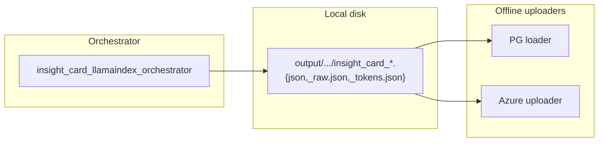

# Insight card batch — next steps

**Date:** 2026-04-09  
**Spec:** [`runtime_assets/insight_cards/insight_card_batching_implementation_detail.md`](../runtime_assets/insight_cards/insight_card_batching_implementation_detail.md)

---

## 1. Full batch run — all seed categories × 100 cards

**Goal:** Generate **100 successful cards per category** for every key under `categories` in packaged [`insight_card_config.json`](../python/tennl/batch/src/tennl/batch/resources/insight-cards/insight_card_config.json).

**Preferred driver (sequential categories, `_batch_seq`):** [`scripts/insight_cards/insight_card_batch_gen_batch_seq.sh`](../scripts/insight_cards/insight_card_batch_gen_batch_seq.sh)

- Reads category keys with **`jq -r '.categories | keys[]'`** from the packaged JSON (see comments at top of script).
- Runs **one orchestrator process per category**, **waiting for each to finish** before starting the next (avoids many concurrent processes all writing triples to disk → IO pressure and possible lost writes under heavy parallel disk load).
- **Inside** each run: orchestrator uses **`--mode parallel --workers`** (default **5**, override `-w 4`).
- Default **count = 100** (`-n` / `--count`).
- **Progress monitoring:** while each run is active, prints a **5-second** status block with **tail of the run log** to the console.
- Logs per category: `python/tennl/batch/output/insight_batch_logs_batch_seq/<slug>_YYYYMMDD_HHMMSS.log`
- Outputs per category: `python/tennl/batch/output/insight_cards_<slug>/` (space → `_` in slug).

**Examples:**

```bash
# From repo root — all categories, 100 cards, 5 workers
./scripts/insight_cards/insight_card_batch_gen_batch_seq.sh

# Single category, 100 cards, 4 workers
./scripts/insight_cards/insight_card_batch_gen_batch_seq.sh -n 100 -w 4 Finance

# Dry-run smoke (no LLM)
./scripts/insight_cards/insight_card_batch_gen_batch_seq.sh -n 2 --dry-run Technology
```

**Not implemented (track later):** **Automatic retries** on provider **rate limiting** or transient API errors; failures stop the category run and are visible in the log (script continues to next category only if you adjust behavior — currently **failed category sets non-zero exit at end** after all runs).

**Manual approach (same semantics as before):** The orchestrator still accepts **one `--category` per process**; any shell loop must run categories **sequentially** if avoiding overlapping disk-heavy batches.

**Suggested command shape** (manual; set `UV_PROJECT_ENVIRONMENT` to batch `.venv`):

- `--count 100`
- `--mode parallel` with `--workers` tuned to API rate limits (e.g. 4–8)
- `--output-dir output/insight_cards_<CategorySlug>` (slug: replace spaces with `_` for `Urban Life` → `Urban_Life` in path)

**Outputs:** For each run, triples under the chosen `--output-dir` (relative to cwd):

- `insight_card_{sanitized_model}_{timestamp_ms}.json`
- `insight_card_{sanitized_model}_{timestamp_ms}_raw.json`
- `insight_card_{sanitized_model}_{timestamp_ms}_tokens.json`

Default if `--output-dir` omitted: **`output/insight_cards`** (relative to cwd) — **not** recommended when looping categories (everything would land in one folder).

**Checklist:**

- [ ] Confirm `TENNL_LLM_PROVIDER` and credentials for the target model.
- [ ] Dry-run one category (`--count 2 --dry-run`) before full parallel batch.
- [ ] Run loop over all 12 categories; monitor logs for future timeouts / LLM errors.
- [ ] Account for `_log_card` dedup: `count` submissions may yield **fewer than 100** rows in `results` if the model repeats title+content; increase `count` or accept dedup behavior (see spec §1.3).

---

## 2. PostgreSQL loader — offline ingest of generated insight card files

**Goal:** **Batch / offline** job that reads the **on-disk triples** (or the main `.json` per card plus optional `_raw` / `_tokens` joins by prefix) and **INSERT**s into Postgres, analogous to article persistence in [`python/tennl/batch/src/tennl/batch/workflows/pg_storage.py`](../python/tennl/batch/src/tennl/batch/workflows/pg_storage.py) (`insert_article` → `content_gen.content_gen_article`).

**Reference pattern (articles):**

- DSN: `CONTENT_GEN_PG_DSN` (default in `pg_storage.py`).
- `insert_article(run_id=..., article_md=..., article_json=..., status=..., ...)` with graceful log-on-failure.

**Design tasks for insight cards:**

- [ ] **Schema:** New table under `content_gen` (or agreed schema), e.g. `content_gen_insight_card` (name TBD), with columns such as:
  - `id` UUID PK (generate new UUID per card file or derive from stable hash of prefix + path)
  - `run_id` or `artifact_prefix` (string) — correlate the three files
  - `category` (text) — seed category
  - `card_json` JSONB — payload from main `*.json` (or merged with raw/tokens if desired)
  - `raw_response_json` JSONB — optional, from `*_raw.json`
  - `token_usage_json` JSONB — optional, from `*_tokens.json`
  - `provider`, `model`, `created_at`, `source_path` (text) — audit
  - `status` / `error_message` if ingesting failed parses
- [ ] **Migration / DDL:** Checked into repo or applied via infra playbook; document in spec or `infra/`.
- [ ] **Loader CLI or module:** e.g. `python -m tennl.batch.... insight_card_pg_loader --input-dir output/insight_cards_Finance [--recursive]`
  - Match `*_raw.json` / `*_tokens.json` to main file by **shared prefix** (strip `_raw` / `_tokens` suffixes before `_tokens` — naming: `{prefix}_raw.json` where `prefix` is `insight_card_..._ms`).
  - Idempotent inserts (`ON CONFLICT DO NOTHING` or upsert by `artifact_prefix`).
- [ ] **Env:** Reuse `CONTENT_GEN_PG_DSN` or add `INSIGHT_CARD_PG_DSN` if a different DB is required.

**Scope:** **Offline** only — does not replace live orchestrator writes; runs **after** batch generation.

---

## 3. Azure Storage upload — offline uploader for artifact triples

**Goal:** **Batch / offline** uploader that pushes the same **folder of triples** to **Azure Blob Storage** (container + path convention TBD), for backup, downstream pipelines, or cross-env sync.

**Tasks:**

- [ ] Define container and blob path layout (e.g. `insight-cards/{category}/{prefix}.json`, same for `_raw` and `_tokens`).
- [ ] Use existing repo Azure patterns / credentials (same as article batch if any); document required env vars (`AZURE_STORAGE_ACCOUNT`, connection string, or managed identity).
- [ ] Implement idempotent uploads (overwrite or version by etag).
- [ ] CLI: e.g. `insight_card_azure_upload --local-dir output/insight_cards_Finance --prefix insight-cards/prod/2026-04-09/`
- [ ] Optional: tie metadata (category, model) as blob index tags or sidecar manifest JSON.

**Scope:** **Offline** only — post-generation; complementary to PG loader.

---

## 4. Relationship between artifacts, Postgres, and Azure



---

## 5. Robustness backlog (optional — from plan)

Not required for the three items above; track if needed:

- Structured run / correlation IDs in orchestrator logs
- Optional JSON sidecar when a **parallel future** fails (index + exception)
- Thread-pool pre-warm
- Richer batch summary: submitted vs LLM-error vs dedup-skipped vs unique successes

**Already implemented:** parallel `Future.result(timeout=...)`, cancel/timeout/error logging.

---

*End of task list.*
